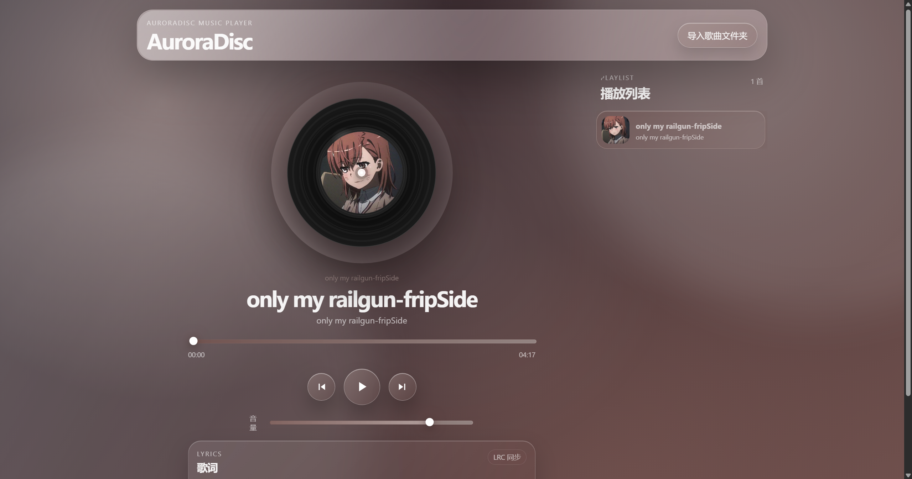

# AuroraDisc Music Player

<p align="center">
  一个基于 HTML、CSS、JavaScript 构建的本地音乐播放器，
  结合玻璃拟态界面、唱片播放动效、歌词展示与封面主题色联动，打造更有氛围感的听歌体验。
</p>

<p align="center">
  
  
  
  
</p>

## 项目简介

AuroraDisc Music Player 是一个无需后端、开箱即用的本地音乐播放器项目。
你只需要打开页面并导入本地歌曲文件夹，即可获得带有播放列表、歌词显示、唱片旋转动画和动态主题色的完整播放器体验。

## 功能亮点

- 支持按文件夹批量导入本地歌曲
- 自动识别音频、封面和歌词文件
- 支持 `.lrc` 同步歌词高亮
- 支持 `.txt` 普通歌词展示
- 播放时唱片旋转，增强沉浸感
- 根据封面主色自动切换界面主题
- 采用 iOS 风格 Liquid Glass 半透明视觉设计

## 界面截图

> 你可以把实际截图放到 `assets/` 或 `screenshots/` 目录，然后替换下面的图片路径。

### 首页 / 播放器界面



### 播放列表与歌词区域


### 主题色联动效果


## 快速开始

本项目不依赖构建工具，也不需要后端服务。

### 运行方式

直接双击打开 `index.html` 即可运行。

### 推荐浏览器

- Chrome
- Edge

项目使用了 `webkitdirectory` 来选择整个文件夹，因此更推荐 Chromium 内核浏览器。

## 使用说明

1. 打开 `index.html`
2. 点击右上角 **导入歌曲文件夹**
3. 选择包含多首歌曲的父文件夹
4. 播放器会自动按子文件夹识别歌曲、封面和歌词
5. 点击播放列表中的任意歌曲开始播放

## 推荐目录结构

建议每首歌放在独立文件夹中，每个文件夹包含：

- 一个 `.mp3` 音频文件
- 一个封面文件：`.png`、`.jpg`、`.jpeg`、`.webp`
- 可选歌词文件：`.lrc` 或 `.txt`

```txt
Music/
  Song A/
    song.mp3
    cover.png
    lyric.lrc
  Song B/
    music.mp3
    cover.jpg
    lyric.txt
```

如果某个子文件夹中没有找到 MP3，播放器会自动跳过该文件夹。

## 功能说明

### 播放控制

- 开始 / 暂停
- 上一曲 / 下一曲
- 播放进度拖动
- 当前时间与总时长显示
- 音量调节
- 播放结束自动切换下一首

### 播放列表

- 自动扫描导入目录中的子文件夹
- 按文件夹路径排序生成列表
- 显示歌曲封面、歌曲名、文件夹名
- 高亮当前播放歌曲

### 歌词显示

播放器会自动读取歌曲文件夹中的歌词文件：

- `.lrc`：按时间轴同步滚动并高亮当前歌词
- `.txt`：按普通文本展示歌词内容

### 视觉效果

- 唱片封面随播放状态旋转
- 玻璃拟态半透明界面
- 轻量悬浮式布局
- 封面图自动居中显示
- 根据封面主色自动调整页面主题

## 自动主题色

播放器会在切换歌曲时，通过 Canvas 分析当前封面图像的主色调，并将颜色同步到：

- 页面背景
- 播放按钮光晕
- 进度条
- 音量条
- 当前播放歌曲卡片
- 歌词高亮颜色

所有分析过程都在浏览器本地完成，不会上传音乐文件或图片文件。

## 支持的文件类型

### 音频

- `.mp3`

### 封面

- `.png`
- `.jpg`
- `.jpeg`
- `.webp`

### 歌词

- `.lrc`
- `.txt`

## 项目结构

```txt
AuroraDisc-Music-Player/
├─ index.html
├─ style.css
├─ script.js
├─ README.md
└─ Music/
```

主要文件说明：

- `index.html`：页面结构与播放器布局
- `style.css`：整体视觉样式、玻璃效果、布局与动画
- `script.js`：文件导入、播放逻辑、播放列表、歌词解析、主题色提取

## 注意事项

- 导入后读取的是你本地选择的文件，不会上传到网络
- 如果浏览器阻止自动播放，需要手动点击播放按钮
- 如果歌曲没有封面，会使用默认封面
- 如果歌曲没有歌词，会显示默认提示内容
- 当前版本主要面向本地文件夹音乐播放场景

## 适用场景

- 前端练手项目展示
- 本地音乐播放器原型
- 学习文件导入、音频控制、歌词解析、主题色提取等前端能力
- 个人作品集中的视觉化小项目

## 可扩展方向

- 支持更多音频格式
- 支持播放模式切换（单曲循环、随机播放）
- 支持记住上次播放位置
- 支持搜索与筛选播放列表
- 支持拖拽导入歌曲文件夹
- 支持移动端界面优化

## License

仅供学习与个人项目展示使用。
